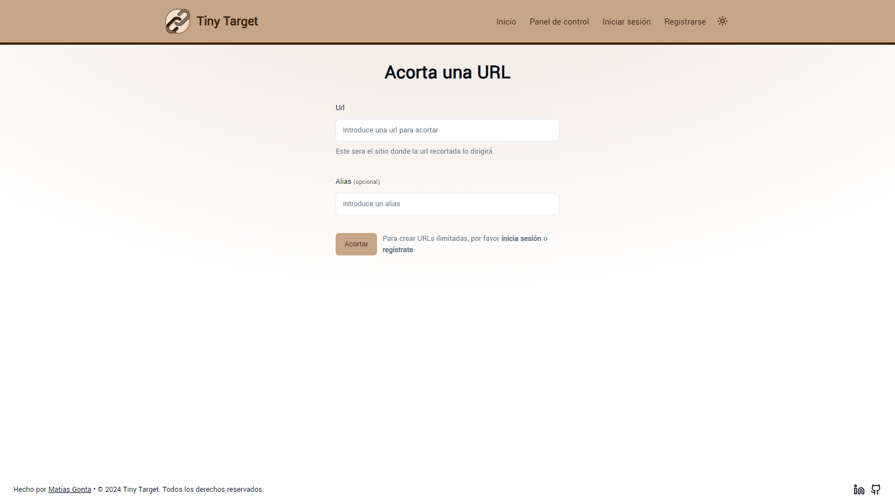

  

---

# Tiny Target

Tiny Target is a URL shortening application that provides users with a streamlined experience for managing and creating shortened URLs. The application features a robust user authentication system, allowing users to register and log in securely. Users have the ability to create customized URLs for free, assigning them personalized aliases. Additionally, they have a control panel where they can view all their created URLs, as well as edit, delete, and copy them for convenient use.

You can <a href="https://www.youtube.com/watch?v=EkUeTFaJWzI" target="_blank">**click here**</a> to see an overview the app in action.

## Features

- Easy-to-Use URL Shortening – Easily and custom create shortened URLs for added convenience and shareability.
- Dashboard Access: After logging in, users gain access to a dashboard showcasing all URLs associated with their account.
- URL Management: Enjoy full control over your URLs with options to edit, delete, or copy them directly from the dashboard.
- Secure Authentication: A reliable login and registration system ensures the security of user accounts and data.
- Enjoys a simple and harmonious interface for a pleasant user experience.
- Customizable Themes: Choose between light, dark, or system-defined themes to suit your preferences.
- Utilizes a toast system to notify the user of the outcomes of various actions and enhance their experience in the application.
- Experience peace of mind with a password recovery feature. Users can easily restore or reset their passwords through a secure email sent by the application, ensuring a smooth recovery process.
- Enjoy a responsive design that adapts to various devices, providing an optimal experience on desktops, tablets, and mobiles.
- Implementation of a streaming system when fetching data, leveraging the features of Next.js.
- Provides a smooth user experience when dynamically loading information.
- Enhanced user experience during data loading thanks to the implementation of skeleton components.

## Technologies Used

- <a href="https://react.dev/" target="_blank">**React**</a>: A JavaScript library for building interactive user interfaces..
- <a href="https://next-intl-docs.vercel.app/docs/getting-started" target="_blank">**Next.js**</a>: A React framework that enables server-side rendering, automatic code splitting, and simplified routing for building powerful and efficient web applications.
- <a href="https://next-auth.js.org/" target="_blank">**Next Auth**</a>: Authentication library for Next.js applications.
- <a href="https://www.typescriptlang.org/docs/" target="_blank">**TypeScript**</a>: A superset of JavaScript that adds static types and other features to the language syntax.
- <a href="https://nodejs.org/es" target="_blank">**Node.js**</a>: A runtime environment for executing JavaScript code server-side.
- <a href="https://www.mongodb.com/es" target="_blank">**MongoDB**</a>: A NoSQL database based on a document data model used for storing and retrieving data.
- <a href="https://mongoosejs.com/" target="_blank">**Mongoose**</a>: An ODM (Object Data Modeling) library for MongoDB and Node.js.
- <a href="https://github.com/aravindnc/mongoose-paginate-v2" target="_blank">**Mongoose Paginate**</a>: Pagination support for Mongoose.
- <a href="https://www.npmjs.com/package/dotenv" target="_blank">**Dotenv**</a>: A zero-dependency module for loading environment variables.
- <a href="https://tailwindcss.com/" target="_blank">**Tailwind CSS**</a>: A utility-first CSS framework that simplifies styling by providing low-level utility classes, enabling a straightforward and fast approach to building modern and responsive interfaces.
- <a href="https://www.npmjs.com/package/clsx" target="_blank">**clsx**</a>: Utility to conditionally build Tailwind CSS classes.
- <a href="https://www.npmjs.com/package/class-variance-authority" target="_blank">**class-variance-authority**</a>: A utility for managing class variances or authorities.
- <a href="https://www.npmjs.com/package/tailwindcss-animate" target="_blank">**tailwindcss-animate**</a>: A Tailwind CSS plugin for adding animation utilities to your styles.
- <a href="https://www.npmjs.com/package/tailwind-merge" target="_blank">**Tailwind Merge**</a>: A Tailwind CSS plugin for merging utilities.
- <a href="https://lucide.dev/guide/packages/lucide-react" target="_blank">**Lucide React**</a>: A set of React icons from the Lucide icon library.
- <a href="https://www.npmjs.com/package/next-themes" target="_blank">**Next theme**</a>: A utility for managing themes in Next.js applications.
- <a href="https://ui.shadcn.com/" target="_blank">**Shadcn**</a>: A collection of UI components for React.
- <a href="https://react-hook-form.com/" target="_blank">**React Hook Form**</a>: Library for managing forms in React
- <a href="https://zod.dev/" target="_blank">**Zod**</a>: A TypeScript-first schema declaration and validation library.
- <a href="https://github.com/dcodeIO/bcrypt.js" target="_blank">**Bcryptjs**</a>: A library for hashing passwords.
- <a href="https://jwt.io/" target="_blank">**JWT**</a>: A library for generating and verifying JSON Web Tokens (JWT).
- <a href="https://resend.com/" target="_blank">**Resend**</a>: A library for handling email resend functionality.
- <a href="https://sonner.emilkowal.ski/" target="_blank">**Sonner**</a>: A toast notification library for React applications.

## Project Structure

- `public`: Contains static assets such as images and icons used in the application.
- `src/app`: Contains the main files and pages of the application.
    - `/api`: Contiene las API routes.
- `src/lib`: Holds functions and utilities specific to handling operations such as user registration, password management, URL manipulation, etc.
- `src/components`: Contains reusable components used in different parts of the application.
- `src/models`: Contains TypeScript interfaces, models or types used for defining data structures.
- `src/validations`: Contains validation files using the Zod library to ensure data integrity in the application.
- `src/utils`: Contains utilities and helper functions used in the application.

## Authors

- Matías Gonta

If you have any questions, concerns or interest, feel free to contact me.

---

  

---

# Tiny Target

Tiny Target es una aplicación de acortamiento de URL que brinda a los usuarios una experiencia simplificada para gestionar y crear URLs acortadas. La aplicación cuenta con un sólido sistema de autenticación de usuarios que permite registrarse e iniciar sesión de manera segura. Los usuarios tienen la capacidad de crear URLs personalizadas de forma gratuita, asignándoles alias personalizados. Además, cuentan con un panel de control donde pueden visualizar todas sus URLs creadas, así como editarlas, eliminarlas y copiarlas para su uso conveniente.

Puedes hacer <a href="https://www.youtube.com/watch?v=EkUeTFaJWzI" target="_blank">**click aquí**</a> para ver una visión general de la aplicación en acción.

## Características

- Acortamiento de URL fácil de usar: cree URL acortadas de forma fácil y personalizada para mayor comodidad y capacidad de compartir.
- Acceso a un panel de control: después de iniciar sesión, los usuarios obtienen acceso a un panel que muestra todas las URL asociadas con su cuenta.
- Gestión de URL: disfrute de un control total sobre sus URL con opciones para editarlas, eliminarlas o copiarlas directamente desde el panel.
- Autenticación segura: un sistema confiable de inicio de sesión y registro garantiza la seguridad de las cuentas y los datos de los usuarios.
- Disfruta de una interfaz sencilla y armoniosa para una experiencia de usuario agradable.
- Temas personalizables: elija entre temas claros, oscuros o definidos por el sistema según sus preferencias.
- Utiliza un sistema de notificaciones de tipo "toast" para informar al usuario los resultados de diversas acciones y mejorar su experiencia en la aplicación.
- Experimente la tranquilidad con una función de recuperación de contraseña. Los usuarios pueden restaurar o restablecer fácilmente sus contraseñas a través de un correo electrónico seguro enviado por la aplicación, lo que garantiza un proceso de recuperación sin problemas.
- Disfrute de un diseño responsivo que se adapta a varios dispositivos, brindando una experiencia óptima en computadoras de escritorio, tabletas y móviles.
- Implementación de un sistema de streaming al momento de buscar datos, aprovechando las funcionalidades de Next.js.
- Proporciona una experiencia de usuario fluida al cargar información dinámicamente.
- Experiencia de usuario mejorada durante la carga de datos gracias a la implementación de componentes esqueleto.

## Tecnologías utilizadas

- <a href="https://react.dev/" target="_blank">**React**</a>: Una biblioteca de JavaScript para crear interfaces de usuario interactivas.
- <a href="https://next-intl-docs.vercel.app/docs/getting-started" target="_blank">**Next.js**</a>: Un framework de React que permite la representación del lado del servidor, la división automática de código y el enrutamiento simplificado para crear aplicaciones web potentes y eficientes.
- <a href="https://next-auth.js.org/" target="_blank">**Next Auth**</a>: Una biblioteca de autenticación para aplicaciones Next.js.
- <a href="https://www.typescriptlang.org/docs/" target="_blank">**TypeScript**</a>: Un superconjunto de JavaScript que agrega tipos estáticos y otras funciones a la sintaxis del lenguaje.
- <a href="https://nodejs.org/es" target="_blank">**Node.js**</a>: Un entorno de ejecución para llevar a cabo código JavaScript en el servidor.
- <a href="https://www.mongodb.com/es" target="_blank">**MongoDB**</a>: Una base de datos NoSQL basada en un modelo de datos de documentos utilizada para almacenar y recuperar datos.
- <a href="https://mongoosejs.com/" target="_blank">**Mongoose**</a>: Una biblioteca ODM (Mapeo de Datos de Objetos) para MongoDB y Node.js.
- <a href="https://github.com/aravindnc/mongoose-paginate-v2" target="_blank">**Mongoose Paginate**</a>: Soporte de paginación para Mongoose.
- <a href="https://www.npmjs.com/package/dotenv" target="_blank">**Dotenv**</a>: Un módulo sin dependencias para cargar variables de entorno.
- <a href="https://tailwindcss.com/" target="_blank">**Tailwind CSS**</a>: Un framework de CSS centrado en las utilidades, que simplifica el estilo al proporcionar clases de utilidades de bajo nivel, lo que permite un enfoque sencillo y rápido para crear interfaces modernas y responsivas.
- <a href="https://www.npmjs.com/package/clsx" target="_blank">**clsx**</a>: Una utilidad para construir clases de Tailwind CSS de forma condicional.
- <a href="https://www.npmjs.com/package/class-variance-authority" target="_blank">**class-variance-authority**</a>: Una utilidad para gestionar variaciones de clases o autoridades.
- <a href="https://www.npmjs.com/package/tailwindcss-animate" target="_blank">**tailwindcss-animate**</a>: Un complemento CSS de Tailwind para agregar utilidades de animación a sus estilos..
- <a href="https://www.npmjs.com/package/tailwind-merge" target="_blank">**Tailwind Merge**</a>: Un complemento CSS de Tailwind para fusionar utilidades.
- <a href="https://lucide.dev/guide/packages/lucide-react" target="_blank">**Lucide React**</a>: Un conjunto de íconos de React de la biblioteca de íconos de Lucide.
- <a href="https://www.npmjs.com/package/next-themes" target="_blank">**Next theme**</a>: Una utilidad para gestionar temas en aplicaciones Next.js.
- <a href="https://ui.shadcn.com/" target="_blank">**Shadcn**</a>: Una colección de componentes de UI para React.
- <a href="https://react-hook-form.com/" target="_blank">**React Hook Form**</a>: Una biblioteca para gestionar formularios en React.
- <a href="https://zod.dev/" target="_blank">**Zod**</a>: Una biblioteca de validación y declaración de esquemas basada en TypeScript.
- <a href="https://github.com/dcodeIO/bcrypt.js" target="_blank">**Bcryptjs**</a>: Una biblioteca para cifrar contraseñas.
- <a href="https://jwt.io/" target="_blank">**JWT**</a>: Una biblioteca para generar y verificar Tokens Web JSON (JWT).
- <a href="https://resend.com/" target="_blank">**Resend**</a>: Una biblioteca para manejar la funcionalidad de reenvío de correo electrónico.
- <a href="https://sonner.emilkowal.ski/" target="_blank">**Sonner**</a>: Una biblioteca de notificaciones de tipo "toast" para aplicaciones React.

## Estructura del proyecto

- `public`: Contiene imágenes e iconos utilizados en la aplicación.
- `src/app`: Contiene los archivos principales y páginas de la aplicación.
    - `/api`: Contiene las API routes.
- `src/lib`: Contiene funciones y utilidades específicas para manejar operaciones como registro de usuarios, gestión de contraseñas, manipulación de URLs, etc.
- `src/components`: Contiene componentes reutilizables utilizados en diferentes partes de la aplicación.
- `src/models`: Contiene interfaces, modelos o tipos de TypeScript utilizados para definir estructuras de datos.
- `src/validations`: Contiene archivos de validación utilizando la librería Zod para garantizar la integridad de los datos en la aplicación.
- `src/utils`: Contiene utilidades y funciones auxiliares utilizadas en la aplicación.

## Autores

- Matías Gonta

Si tiene alguna pregunta, inquietud o interés, no dude en ponerse en contacto conmigo.